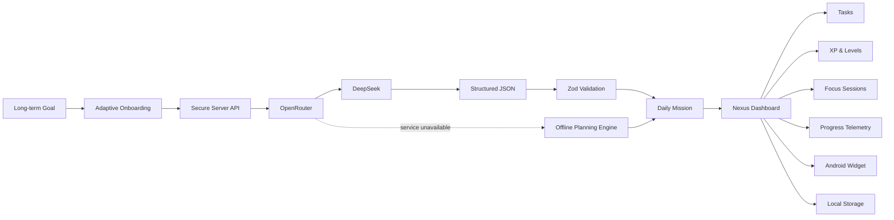
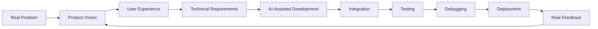

<!--
╔══════════════════════════════════════════════════════════════════════════════╗
║                                                                              ║
║                     GUSTAVO ARAÚJO • GUUH-DEV                               ║
║                    AI-NATIVE PRODUCT BUILDER                                ║
║                                                                              ║
║              DESIGN THE VISION • DIRECT THE AI • SHIP                       ║
║                                                                              ║
╚══════════════════════════════════════════════════════════════════════════════╝
-->

<div align="center">


<a href="https://git.io/typing-svg">
  
</a>

<br/>

<a href="mailto:gustavobebe720@gmail.com">
  
</a>
<a href="https://www.linkedin.com/in/gustavo-araujo-542019316/">
  
</a>
<a href="https://www.upwork.com/freelancers/~0150fe8d8539ae61d9">
  
</a>
<a href="https://github.com/Guuh-dev?tab=followers">
  
</a>

<br/><br/>


<br/><br/>

```text
┌──────────────────────────────────────────────────────────────────────────────┐
│                           NEXUS SYSTEM TELEMETRY                             │
├──────────────────────────────────────────────────────────────────────────────┤
│ Product vision        ████████████████████  100%                             │
│ AI orchestration      ███████████████████░   95%                             │
│ Product execution     ███████████████████░   95%                             │
│ Design obsession      ████████████████████  100%                             │
│ Giving up             ░░░░░░░░░░░░░░░░░░░░    0%                             │
└──────────────────────────────────────────────────────────────────────────────┘
```

</div>

---

## `> INITIALIZING PROFILE...`

```yaml
identity:
  name: Gustavo Araújo
  username: Guuh-dev
  location: Brazil

roles:
  - AI-Native Product Builder
  - Mobile & Web Developer
  - Product-Oriented Creator

building:
  - Mobile applications
  - AI-powered systems
  - SaaS products and MVPs
  - Landing pages
  - Automation workflows

current_mission:
  - Ship useful products
  - Build a powerful portfolio
  - Work with real freelance clients
  - Turn technical execution into sustainable income
  - Scale from a phone-first setup into a complete workstation

system_status: ONLINE
```

I transform ideas into **working digital products** by combining product thinking, interface design, software development and artificial intelligence.

My strongest skill is orchestration. I define the product vision, structure requirements, direct AI tools, connect APIs, inspect generated code, debug failures, test complete flows and keep iterating until the idea becomes something people can actually use.

> **I do not use AI to avoid building.**  
> **I use AI to build faster, explore further and ship more ambitious products.**

---

# 🚀 Flagship System

<div align="center">


### A personal execution system that transforms long-term goals into realistic daily missions.

<a href="https://github.com/Guuh-dev/Nexus-AI-v1">
  
</a>


<br/><br/>

<a href="https://github.com/Guuh-dev/Nexus-AI-v1">
  
</a>

</div>

<br/>

<table>
<tr>
<td width="50%" valign="top">

<h3>🧠 Intelligence Engine</h3>

- Adaptive four-stage onboarding
- Personalized daily-plan generation
- Goal, routine and priority analysis
- Secure OpenRouter integration
- DeepSeek model support
- Structured JSON responses
- Zod schema validation
- Automatic repair attempts
- Safe local planning fallback

</td>
<td width="50%" valign="top">

<h3>🎮 Progression Engine</h3>

- Main daily missions
- Executable task breakdowns
- XP and progressive levels
- Streak calculation
- Achievements
- Weekly telemetry
- Category distribution
- Focus-session tracking
- Historical execution data

</td>
</tr>

<tr>
<td width="50%" valign="top">

<h3>📱 Experience Engine</h3>

- React Native application
- Expo Router architecture
- Android and responsive web
- AMOLED-first interface
- Original pixel-art mascot
- Native notifications
- Android widget architecture
- Deep links
- Mobile-first interaction design

</td>
<td width="50%" valign="top">

<h3>🛡️ Reliability Engine</h3>

- Local-first architecture
- Offline mode
- AsyncStorage persistence
- Versioned storage migrations
- Error boundaries
- Timeout and retry protection
- Duplicate-request prevention
- Import and export backups
- Recoverable failure states

</td>
</tr>
</table>

## System architecture



<div align="center">

`EXPO ROUTER` • `REACT NATIVE` • `TYPESCRIPT` • `OPENROUTER` • `DEEPSEEK` • `ZOD` • `ASYNCSTORAGE` • `EAS BUILD` • `RENDER`

</div>

---

# 🧩 Product Capabilities

<table>
<tr>
<td width="25%" align="center" valign="top">

<h3>📱 Mobile</h3>

Android-first applications, responsive interfaces, local storage, notifications and native-ready features.

</td>
<td width="25%" align="center" valign="top">

<h3>🌐 Web</h3>

Landing pages, dashboards, portfolios, SaaS interfaces and conversion-focused experiences.

</td>
<td width="25%" align="center" valign="top">

<h3>🤖 Artificial Intelligence</h3>

AI copilots, prompt architecture, structured outputs, model integrations and safe fallback systems.

</td>
<td width="25%" align="center" valign="top">

<h3>⚙️ Automation</h3>

Deployment pipelines, API connections, GitHub workflows and AI-assisted maintenance systems.

</td>
</tr>
</table>

---

# 🛠️ Technology Orbit

<div align="center">

## Core Product Stack


<br/><br/>


<br/><br/>

## Web and Interface


<br/><br/>


<br/><br/>

## Data, Infrastructure and Deployment


<br/><br/>


<br/><br/>

## AI Models and Tools


<br/><br/>

## Expanding Knowledge


</div>

> These are technologies I actively build with, integrate or explore through hands-on projects and AI-assisted development. My focus is not collecting logos. It is combining tools into systems that work.

---

# ⚡ Execution Protocol



```text
01. Find a problem worth solving
02. Define exactly what the product must accomplish
03. Design the experience and visual identity
04. Convert the idea into precise technical requirements
05. Direct AI tools to accelerate execution
06. Connect interfaces, APIs, storage and business logic
07. Test complete user flows
08. Debug the cause, not only the symptom
09. Deploy, observe, improve and repeat
```

I care about the complete product:

- Product usefulness
- User experience
- Visual identity
- Technical architecture
- Security
- API costs
- Error handling
- Offline behavior
- Performance
- Deployment
- Maintenance
- Monetization

---

# 📡 Current Transmission

```diff
+ Shipping Nexus AI as a polished Android product
+ Building an automated development and update pipeline
+ Creating stronger mobile and web portfolio projects
+ Exploring AI-native product architecture
+ Looking for real freelance opportunities
+ Turning technical execution into sustainable revenue
```

<div align="center">

```text
             IDEA
               │
               ▼
         WORKING PRODUCT
               │
               ▼
            PORTFOLIO
               │
               ▼
         REAL-WORLD VALUE
               │
               ▼
            CLIENTS
               │
               ▼
            REVENUE
               │
               ▼
         BETTER EQUIPMENT
               │
               ▼
        BIGGER PRODUCTS
```

</div>

---

# 📊 GitHub Telemetry

<div align="center">


<br/>


<br/>


<br/><br/>


<br/><br/>


</div>

---

# 🐍 Contribution Protocol

<div align="center">

<picture>
  <source
    media="(prefers-color-scheme: dark)"
    srcset="https://raw.githubusercontent.com/Guuh-dev/Guuh-dev/output/github-contribution-grid-snake-dark.svg"
  />
  <source
    media="(prefers-color-scheme: light)"
    srcset="https://raw.githubusercontent.com/Guuh-dev/Guuh-dev/output/github-contribution-grid-snake.svg"
  />
  
</picture>

<br/>

```text
Every square is evidence that the system kept moving.
```

</div>

---

# 🤝 Let’s Build Something Real

<div align="center">

I am open to freelance work, product collaborations and ambitious ideas involving:

<br/>

<table>
<tr>
<td align="center" width="20%">

### 📱  
**Mobile Apps**

</td>
<td align="center" width="20%">

### 🌐  
**Web Products**

</td>
<td align="center" width="20%">

### 🤖  
**AI Systems**

</td>
<td align="center" width="20%">

### ⚙️  
**Automation**

</td>
<td align="center" width="20%">

### 🚀  
**Product MVPs**

</td>
</tr>
</table>

<br/>

<a href="mailto:gustavobebe720@gmail.com">
  
</a>

<a href="https://www.linkedin.com/in/gustavo-araujo-542019316/">
  
</a>

<a href="https://www.upwork.com/freelancers/~0150fe8d8539ae61d9">
  
</a>

<a href="https://github.com/Guuh-dev/Nexus-AI-v1">
  
</a>

</div>

---

<div align="center">

## `"Ideas are cheap. Execution turns them into systems."`

### `DESIGN THE VISION` • `DIRECT THE INTELLIGENCE` • `SHIP THE PRODUCT`

<br/>

<a href="https://git.io/typing-svg">
  
</a>

<br/><br/>


<br/><br/>

**Gustavo Araújo • Brazil • 2026**

</div>


