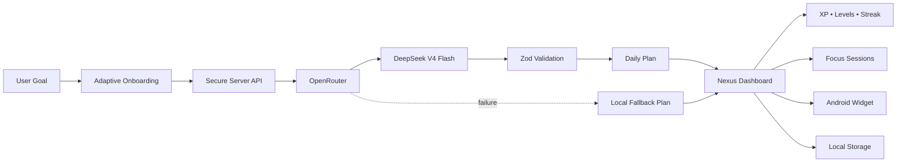
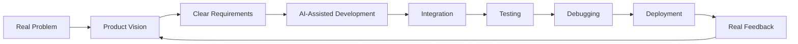

<!--
  ╔══════════════════════════════════════════════════════════════╗
  ║                                                              ║
  ║             GUSTAVO ARAÚJO • GITHUB PROFILE                 ║
  ║                AI-NATIVE PRODUCT BUILDER                    ║
  ║                                                              ║
  ╚══════════════════════════════════════════════════════════════╝
-->

<div align="center">


<a href="https://git.io/typing-svg">
  
</a>

<br/>

<a href="mailto:gustavobebe720@gmail.com">
  
</a>
<a href="https://github.com/Guuh-dev?tab=followers">
  
</a>


</div>

<br/>

<div align="center">

```text
┌──────────────────────────────────────────────────────────────┐
│                    SYSTEM STATUS: ONLINE                     │
│                                                              │
│  Product vision      ████████████████████  100%              │
│  AI orchestration    ███████████████████░   95%              │
│  Building speed      ███████████████████░   95%              │
│  Giving up           ░░░░░░░░░░░░░░░░░░░░    0%              │
└──────────────────────────────────────────────────────────────┘
```

</div>

---

## `> whoami`

```yaml
name: Gustavo Araújo
username: Guuh-dev
location: Brazil

role:
  - AI-Native Product Builder
  - Mobile & Web Developer
  - Product-Oriented Creator

building:
  - Mobile applications
  - AI-powered systems
  - SaaS products
  - Landing pages
  - Automation workflows

current_mission:
  - Ship Nexus AI as a real Android product
  - Build a powerful product portfolio
  - Work with real freelance clients
  - Turn technical execution into sustainable income
  - Scale from a phone-first setup into a complete workstation

status: "Building, testing, deploying and improving."
```

I transform ideas into **working digital products** by combining software development, product thinking, interface design and artificial intelligence.

My strongest skill is orchestration. I define the vision, structure requirements, direct AI agents, connect services, inspect generated code, debug failures, test real flows and keep iterating until the project becomes something people can actually use.

> **I do not use AI to avoid building.**  
> **I use AI to build faster, explore further and ship more ambitious products.**

---

## 🚀 Flagship Project

<div align="center">


### A personal execution system that turns long-term goals into realistic daily missions.

[](https://github.com/Guuh-dev/Nexus-AI-v1)
[](https://github.com/Guuh-dev/Nexus-AI-v1)
[](https://github.com/Guuh-dev/Nexus-AI-v1)

</div>

<br/>

<table>
<tr>
<td width="50%" valign="top">

### 🧠 Intelligent Planning

- Adaptive four-step onboarding
- Personalized daily mission generation
- Goal, routine and priority analysis
- Structured AI responses
- Automatic JSON validation
- Repair attempt for malformed responses
- Safe local planning fallback

</td>
<td width="50%" valign="top">

### 🎮 Personal Progression

- Daily tasks and main missions
- XP and progressive levels
- Achievements and streaks
- Weekly progress telemetry
- Category distribution
- Focus session history
- Real execution tracking

</td>
</tr>

<tr>
<td width="50%" valign="top">

### 📱 Mobile Experience

- React Native and Expo Router
- Android and responsive web
- AMOLED-first interface
- Pixel-art AI mascot
- Native notifications
- Android home-screen widget
- Deep links and quick access

</td>
<td width="50%" valign="top">

### 🛡️ Reliability

- Local-first architecture
- Offline mode
- AsyncStorage persistence
- Versioned data migrations
- Error boundaries
- Timeout and retry protection
- Import and export backups

</td>
</tr>
</table>

### Nexus AI architecture



### Core technology

<div align="center">


</div>

---

## 🧩 What I Build

<table>
<tr>
<td width="50%" valign="top">

### 📱 Mobile Applications

I create mobile-first products with attention to usability, performance and visual identity.

- Android applications
- React Native interfaces
- Expo Router navigation
- Local-first experiences
- Native-ready features
- Notifications and widgets

</td>
<td width="50%" valign="top">

### 🤖 AI-Powered Products

I integrate AI as part of the product architecture, not as a decorative chatbot.

- AI copilots
- Intelligent planning systems
- Prompt and context architecture
- Structured model responses
- OpenRouter integrations
- Fallback and validation systems

</td>
</tr>

<tr>
<td width="50%" valign="top">

### 🌐 Web Experiences

I build responsive interfaces designed to communicate, convert and feel like real products.

- Landing pages
- SaaS dashboards
- Business websites
- Portfolios
- Interactive interfaces
- Mobile-first experiences

</td>
<td width="50%" valign="top">

### ⚙️ Automation Systems

I connect tools and workflows to reduce repetitive work and accelerate delivery.

- AI-assisted development flows
- GitHub-based delivery
- Deployment pipelines
- API integrations
- Automated maintenance
- Agent-directed workflows

</td>
</tr>
</table>

---

## 🛠️ Technologies I Build With

<div align="center">

### Core Languages


<br/><br/>

### Frontend and Mobile


<br/><br/>


### Backend and Data


<br/><br/>


### Artificial Intelligence


### Automation and Deployment


<br/><br/>


### Design and Product


<br/><br/>


</div>

> These are technologies I actively build, integrate or experiment with through hands-on projects and AI-assisted development. My focus is not collecting logos. It is understanding how to combine tools into working products.

---

## ⚡ My Build System



```text
01. Find a problem worth solving
02. Define exactly what the product should accomplish
03. Design the user journey and visual identity
04. Convert the vision into precise technical requirements
05. Direct AI agents and development tools
06. Connect interfaces, APIs, data and business logic
07. Test complete real-world flows
08. Debug failures instead of hiding them
09. Deploy, observe, improve and repeat
```

I care about the entire product, including:

- User experience
- Product usefulness
- Technical architecture
- Security
- API costs
- Error handling
- Offline behavior
- Mobile responsiveness
- Deployment
- Maintenance
- Monetization

---

## 📡 Current Transmission

```diff
+ Shipping Nexus AI as a polished Android experience
+ Testing secure AI planning with OpenRouter
+ Building Android widgets for daily missions
+ Creating an automated update and maintenance system
+ Improving my portfolio with real products
+ Looking for freelance opportunities and collaborations
+ Turning execution into revenue
```

<div align="center">

### Current objective

```text
BUILD USEFUL PRODUCTS
        ↓
SOLVE REAL PROBLEMS
        ↓
WORK WITH REAL CLIENTS
        ↓
REINVEST IN BETTER TOOLS
        ↓
BUILD EVEN BIGGER PRODUCTS
```

</div>

---

## 📊 GitHub Telemetry

<div align="center">

<picture>
  <source
    srcset="https://github-readme-stats.vercel.app/api?username=Guuh-dev&show_icons=true&include_all_commits=true&count_private=true&hide_border=true&bg_color=07070A&title_color=A78BFA&icon_color=8B5CF6&text_color=E5E7EB&ring_color=8B5CF6"
    media="(prefers-color-scheme: dark)"
  />
  
</picture>

<picture>
  <source
    srcset="https://github-readme-stats.vercel.app/api/top-langs/?username=Guuh-dev&layout=compact&langs_count=8&hide_border=true&bg_color=07070A&title_color=A78BFA&text_color=E5E7EB"
    media="(prefers-color-scheme: dark)"
  />
  
</picture>

<br/><br/>


<br/><br/>


</div>

---

## 🏆 Achievement Terminal

<div align="center">


</div>

---

## 🐍 Contribution Protocol

<div align="center">


</div>

<div align="center">

```text
Every square is proof that the system kept moving.
```

</div>

---

## 🤝 Let’s Build Something Real

I am open to projects involving:

<table>
<tr>
<td align="center">📱<br/><b>Mobile Apps</b></td>
<td align="center">🌐<br/><b>Web Products</b></td>
<td align="center">🤖<br/><b>AI Systems</b></td>
<td align="center">⚙️<br/><b>Automation</b></td>
<td align="center">🚀<br/><b>Product MVPs</b></td>
</tr>
</table>

<div align="center">

<a href="mailto:gustavobebe720@gmail.com">
  
</a>

<a href="https://github.com/Guuh-dev">
  
</a>

<a href="https://github.com/Guuh-dev/Nexus-AI-v1">
  
</a>

</div>

<br/>

<div align="center">

### `"Ideas are cheap. Execution turns them into systems."`

`DESIGN THE VISION` • `DIRECT THE INTELLIGENCE` • `SHIP THE PRODUCT`

<br/>


</div>


